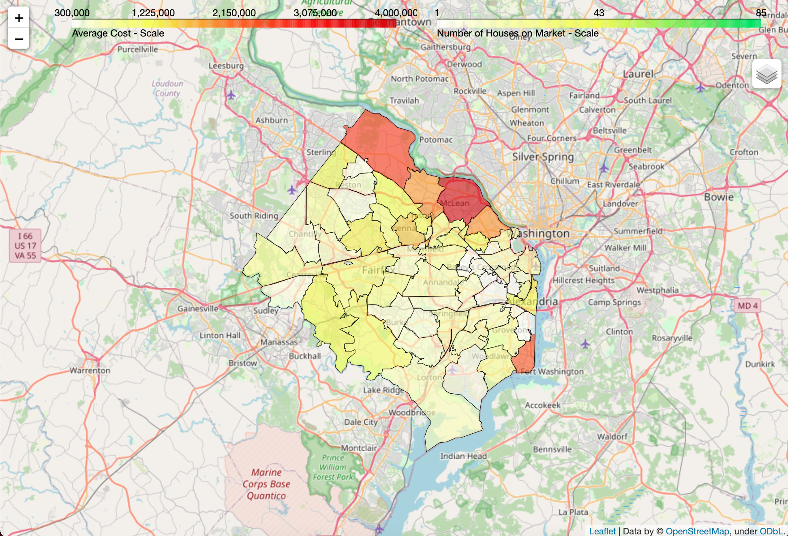

# Real Estate Market Analysis - Folium Choropleth Map
I have created this project from scratch!

This project uses real estate data scraped from Trulia to compare the cost of homes for sale in Northern Virginia (specifically Fairfax and Arlington counties, and the city of Alexandria).

This project creates a choropleth map of average house costs for the current market by zip code.  It also creates a secondary choropleth map that compares the number of houses for sale per zip code.

# How to use:
1. Install the package using pip. Copy and paste the following code into your terminal:

```
pip install git+https://github.com/dominicfawls/RealEstateAnalysisMap
```

2. Create a python file in your desired directory. (named anything)

3. Download the file "va_virginia_zip_codes_geo.min.json" from my repository on GitHub. Save the file in the current directory

3. Import the following functions into your python file as such:

```python
import RealEstateAnalysisMap
from RealEstateAnalysisMap.master import create_nova_map
from RealEstateAnalysisMap.master import create_arlington_map
```

Then, just add the functions and run the file!

```python
create_nova_map()
create_arlington_map()
```

4. The maps will be created as HTML files in the current directory.
There will be two maps: arlington_map.html and fairfax_arlington_map.html.  
The first will only show data for Arlington County, VA, and the latter will show data for all of Northern Virginia (Fairfax Co, Arlington Co, and Alexandria City).\
They can be opened in Chrome or another web browser for easy viewing!\
The map will look like the screenshot below, but it is interactive and will have the most up-to-date data!


